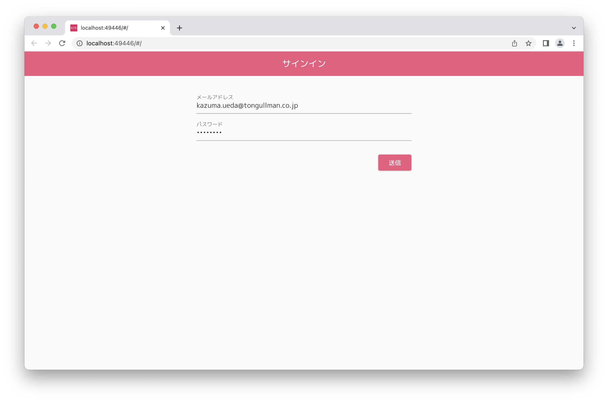
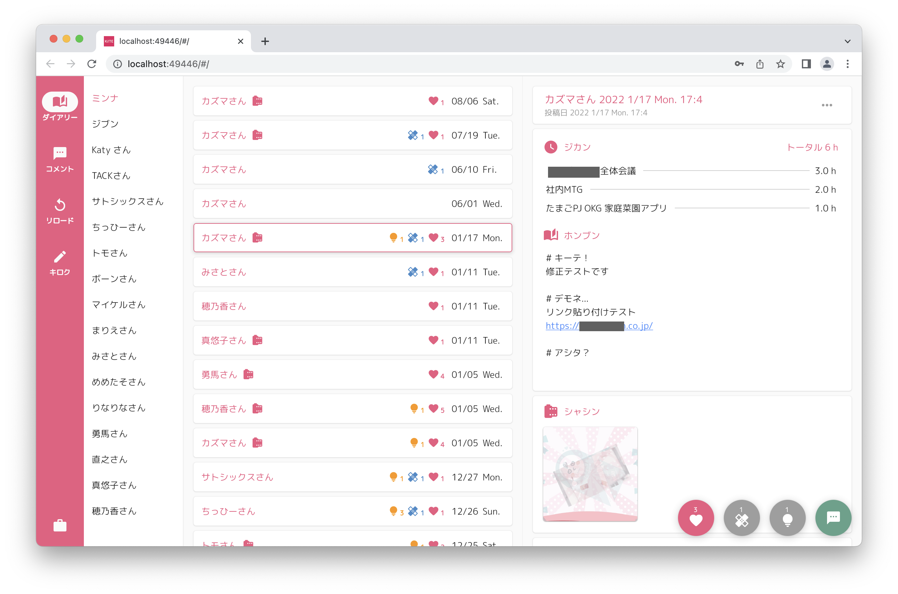
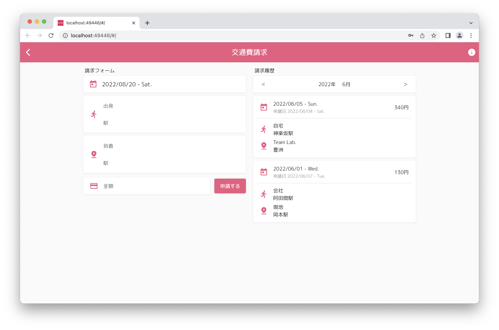
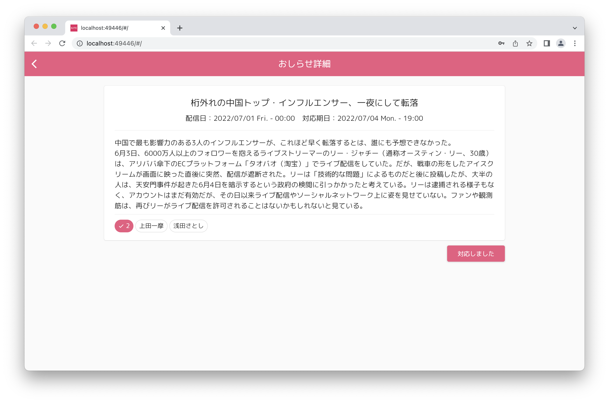
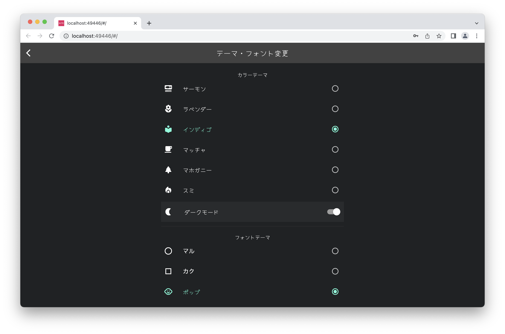
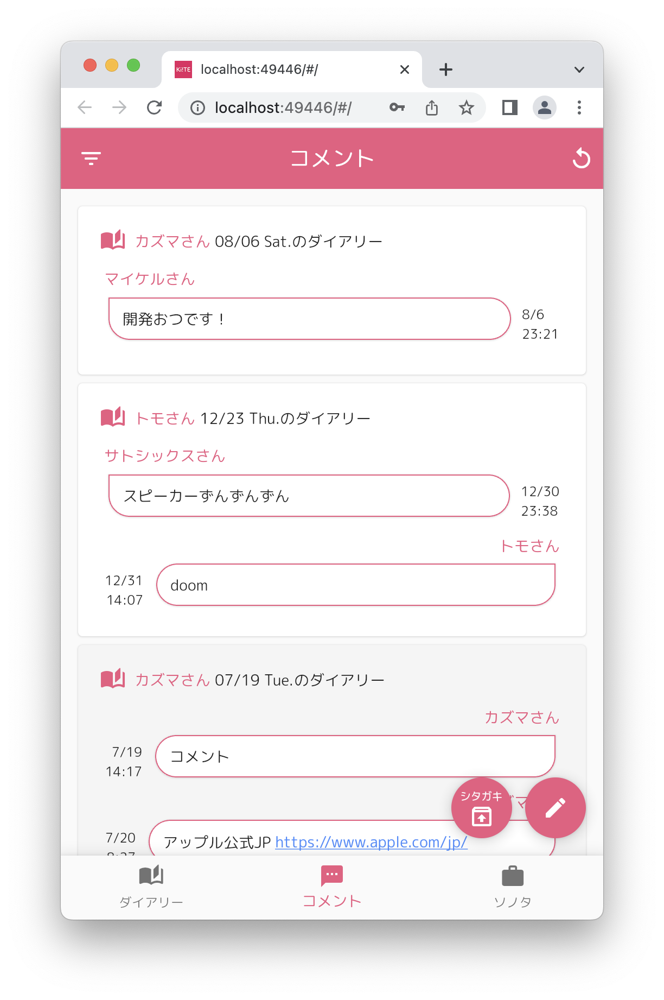
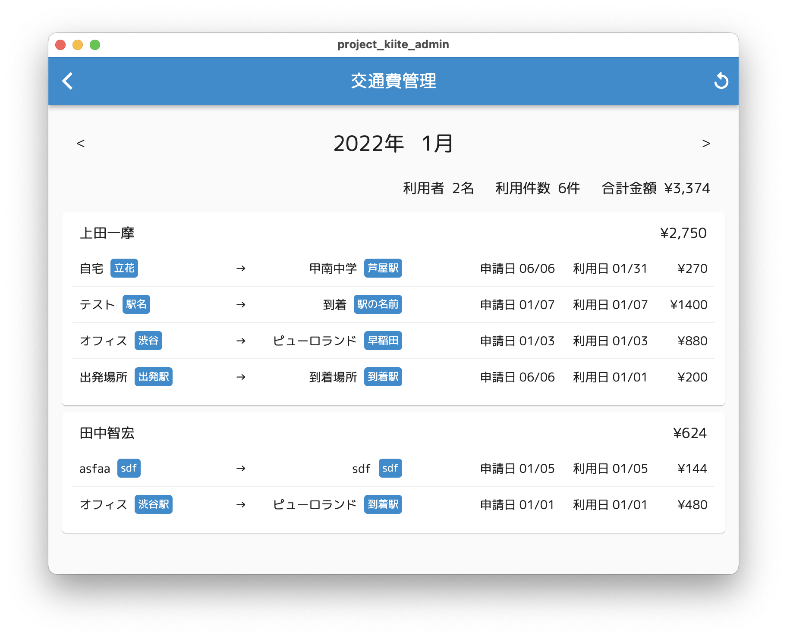

# kiite

- 企業で利用される社内SNS風のアプリのソースコードです。
- 従業員向けの日報や経費請求、お知らせ配信などの機能を持ちます。
- DBにはFirebaseを利用する想定です。
- [こちら](https://flutter-inhouse-sns.web.app/)より実際の利用イメージをご覧いただけます。
(ID `guest.a@email.com` / Password `JPt4RHGRFs3c1LBk`)

## スクリーンショット

